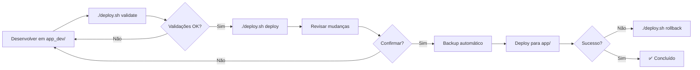

# 🚀 Guia Rápido de Deploy

## Comandos Essenciais

### Deploy Normal
```bash
./deploy.sh verify      # 0. Verificar separação dev vs prod
./deploy.sh validate    # 1. Validar mudanças
./deploy.sh deploy      # 2. Deploy (com confirmação)
```

### Rollback
```bash
./deploy.sh rollback-list    # Ver backups disponíveis
./deploy.sh rollback         # Restaurar último backup
```

## Workflow Completo



## Estrutura do Projeto

```
ProjetoFinancasV3/
├── app_dev/          ← Sempre desenvolva AQUI
│   ├── backend/
│   └── frontend/
├── app/              ← Produção (atualizado via deploy)
├── backups_local/    ← Backups automáticos
├── deploy.sh         ← Script principal
└── scripts/          ← Scripts de deploy e rollback
```

## Regras de Ouro

1. **SEMPRE desenvolver em `app_dev/`**
2. **NUNCA editar `app/` diretamente**
3. **SEMPRE validar antes de deploy**
4. **SEMPRE revisar mudanças antes de confirmar**
5. **Backups são criados automaticamente**

## Documentação Completa

- **Deploy completo**: [`docs/WORKFLOW_DEPLOY.md`](docs/WORKFLOW_DEPLOY.md)
- **Scripts**: [`scripts/README.md`](scripts/README.md)
- **Versionamento**: [`VERSIONAMENTO.md`](VERSIONAMENTO.md)
- **Instruções Copilot**: [`.github/copilot-instructions.md`](.github/copilot-instructions.md)

## Exemplos Práticos

### Exemplo 1: Deploy Simples
```bash
# 1. Validar
./deploy.sh validate
# ✅ 8/8 validações passaram

# 2. Deploy
./deploy.sh deploy
# 🔎 Comparando...
# ❓ Deseja prosseguir? (sim/não): sim
# 💾 Backup criado: app_backup_20251228_143025.tar.gz
# ✅ Deploy concluído!
```

### Exemplo 2: Rollback após Problema
```bash
# 1. Listar backups
./deploy.sh rollback-list
# [1] app_backup_20251228_143025.tar.gz
# [2] app_backup_20251228_120000.tar.gz

# 2. Restaurar último
./deploy.sh rollback
# ⚠️  ATENÇÃO: Esta ação vai substituir o app/ atual!
# ❓ Deseja continuar? (sim/não): sim
# ✅ Rollback concluído!
```

## Suporte

Em caso de dúvidas ou problemas:
1. Consulte [`docs/WORKFLOW_DEPLOY.md`](docs/WORKFLOW_DEPLOY.md)
2. Execute `./deploy.sh` sem argumentos para ver ajuda
3. Verifique [`scripts/README.md`](scripts/README.md)
