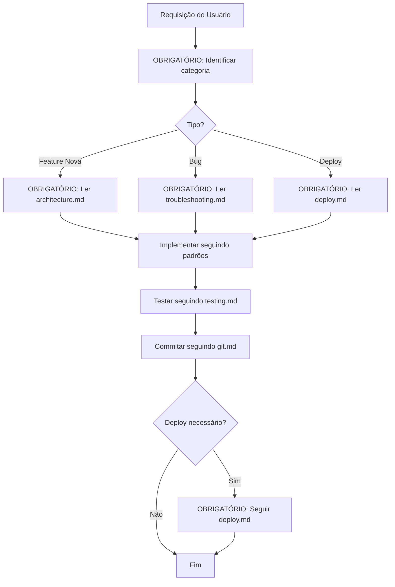

# 🤖 GitHub Copilot Instructions - CORE (v2.0)

**⚠️ Este arquivo contém APENAS regras CRÍTICAS e INVIOLÁVEIS**  
**📚 Documentação completa em:** `docs/`

---

## 🔴 REGRAS CRÍTICAS - NUNCA VIOLAR

Estas 6 regras são **INVIOLÁVEIS**. Qualquer violação causa problemas graves:

### 0. 📚 SEMPRE Consultar Documentação (OBRIGATÓRIO)

**Regra:** ANTES de qualquer implementação/modificação, você DEVE:

1. ✅ Consultar `docs/rules/` para regras aplicáveis
2. ✅ Consultar `docs/guides/` para procedimentos
3. ✅ Consultar `docs/reference/` para referências técnicas

**Workflow obrigatório:**
```
Requisição do Usuário
  ↓
Identificar categoria (feature/bug/deploy)
  ↓
OBRIGATÓRIO: Ler documento correspondente em docs/
  ↓
Implementar seguindo padrões documentados
  ↓
Testar
  ↓
Commitar
```

**Proibições:**
- ❌ NUNCA implementar sem consultar docs/ primeiro
- ❌ NUNCA "adivinhar" regras ou padrões
- ❌ NUNCA violar regras documentadas

**Por quê essa regra existe:**
- Este arquivo tem apenas resumo CRÍTICO (~400 linhas)
- Documentação COMPLETA está em `docs/` (~2000+ linhas)
- Implementar sem consultar = alta chance de violar regras

📚 **Ver:** Toda documentação em [docs/](docs/)

**Exemplo prático:**
```
❌ ERRADO:
User: "Adiciona campo categoria em transações"
AI: [implementa diretamente sem consultar docs]

✅ CORRETO:
User: "Adiciona campo categoria em transações"
AI: [Consulta docs/rules/architecture.md para padrão de domínios]
AI: [Implementa seguindo: model → schema → repository → service → router]
```

---

### 1. 🔄 Sincronização Git (OBRIGATÓRIO)

**Fluxo:** Local → Git → Servidor

**Proibições:**
- ❌ NUNCA editar código no servidor diretamente (vim/nano)
- ❌ NUNCA instalar dependências só no servidor
- ❌ NUNCA commitar .env, *.db, *.log, secrets

**Procedimento correto:**
```bash
# Local
git add + commit + push

# Servidor
git pull → reinstalar deps → restart
```

📚 **Detalhes:** [docs/rules/CRITICAL.md#git-sync](docs/rules/CRITICAL.md#git-sync)

---

### 2. 🔒 Segurança JWT (OBRIGATÓRIO)

**Regras:**
- ✅ JWT obrigatório em TODOS endpoints (exceto /login, /register)
- ❌ NUNCA `user_id = 1` hardcoded
- ❌ NUNCA secrets/senhas no código
- ✅ Sempre `user_id = extract_from_jwt(token)`

**Teste rápido:**
```bash
# Deve retornar 401 se sem token
curl http://localhost:8000/api/v1/transactions/list
```

📚 **Detalhes:** [docs/rules/security.md](docs/rules/security.md)

---

### 3. 🏗️ Arquitetura Modular (OBRIGATÓRIO)

**Backend:** `domains/` isolados
```
domain/
├── models.py      # SQLAlchemy models
├── schemas.py     # Pydantic schemas
├── repository.py  # SQL queries
├── service.py     # Business logic
└── router.py      # HTTP endpoints
```

**Frontend:** `features/` isoladas
```
feature/
├── components/    # UI
├── hooks/         # Estado
├── services/      # API calls
└── types/         # TypeScript types
```

**Proibições:**
- ❌ NUNCA importar entre domínios/features
- ❌ NUNCA lógica de negócio no router
- ❌ NUNCA SQL no service

📚 **Detalhes:** [docs/rules/architecture.md](docs/rules/architecture.md)

---

### 4. 🗄️ Database Único (OBRIGATÓRIO)

**Path oficial:** `app_dev/backend/database/financas_dev.db`

**Proibições:**
- ❌ NUNCA criar `financas.db` em outro local
- ❌ NUNCA usar paths relativos diferentes
- ❌ NUNCA duplicar banco de dados

📚 **Detalhes:** [docs/rules/CRITICAL.md#database](docs/rules/CRITICAL.md#database)

---

### 5. 📅 Filtros de Data (OBRIGATÓRIO)

**SEMPRE usar:**
```python
JournalEntry.Ano == year  # integer
JournalEntry.Mes == month # integer (1-12)
```

**NUNCA usar:**
```python
JournalEntry.Data.like(f'%/{year}')  # ❌ String DD/MM/YYYY
```

**Por quê:** Campo Data é string, filtros lentos e propensos a erro.

📚 **Detalhes:** [docs/rules/CRITICAL.md#date-filters](docs/rules/CRITICAL.md#date-filters)

---

## 📚 Documentação Completa

### Antes de Modificar Código:

**Checklist obrigatório:**
- [ ] Li [docs/rules/CRITICAL.md](docs/rules/CRITICAL.md)?
- [ ] Segui workflow em [docs/workflows/](docs/workflows/)?
- [ ] Consultei guia em [docs/guides/](docs/guides/)?

### Links Rápidos:

| Categoria | Documento | Quando Usar |
|-----------|-----------|-------------|
| 🚀 **Início** | [quick-start.md](docs/guides/quick-start.md) | Iniciar projeto do zero |
| 🔒 **Segurança** | [security.md](docs/rules/security.md) | Qualquer auth/JWT |
| 🏗️ **Arquitetura** | [architecture.md](docs/rules/architecture.md) | Criar domínios/features |
| 🚢 **Deploy** | [deploy.md](docs/guides/deploy.md) | Deploy em produção |
| 🔧 **Problemas** | [troubleshooting.md](docs/guides/troubleshooting.md) | Erros/bugs |
| 🧪 **Testes** | [testing.md](docs/guides/testing.md) | Testar isolamento |
| 📡 **APIs** | [api-endpoints.md](docs/reference/api-endpoints.md) | Referência de endpoints |
| 🗄️ **Database** | [database-schema.md](docs/reference/database-schema.md) | Schema do banco |
| 👤 **Contas** | [accounts.md](docs/reference/accounts.md) | Usuários de teste |

---

## 🎯 Workflow Típico



**Passos OBRIGATÓRIOS (nunca pular):**
1. ✅ Ler requisição do usuário
2. ✅ Identificar categoria (feature, bug, deploy, etc)
3. ✅ **CONSULTAR documento correspondente em `docs/`** ← OBRIGATÓRIO!
4. ✅ Implementar seguindo padrões documentados
5. ✅ Testar isoladamente
6. ✅ Commitar com mensagem descritiva
7. ✅ Se necessário, fazer deploy seguindo guia

**⚠️ IMPORTANTE:** Passo 3 NÃO é opcional. SEMPRE consulte `docs/` antes de implementar!

**Validação automática:**
- Antes de retornar resposta ao usuário, pergunte-se:
  - [ ] Consultei `docs/` para esta tarefa?
  - [ ] Segui padrões documentados?
  - [ ] Não violei nenhuma regra crítica?

---

## 🚨 Ações Proibidas (Nunca Fazer)

| ❌ Proibido | ✅ Correto | Documento |
|-------------|-----------|-----------|
| Editar código no servidor | Local → git → servidor | [CRITICAL.md](docs/rules/CRITICAL.md#git-sync) |
| `user_id = 1` hardcoded | `extract_from_jwt(token)` | [security.md](docs/rules/security.md) |
| Importar entre domínios | Usar `shared/` | [architecture.md](docs/rules/architecture.md) |
| SQL no service | SQL no repository | [architecture.md](docs/rules/architecture.md) |
| Criar `financas.db` na raiz | Usar path oficial | [CRITICAL.md](docs/rules/CRITICAL.md#database) |
| Filtrar por campo Data | Filtrar por Ano/Mes | [CRITICAL.md](docs/rules/CRITICAL.md#date-filters) |
| Commitar .env | Usar .gitignore | [security.md](docs/rules/security.md) |
| Deploy sem backup | Backup primeiro | [deploy.md](docs/guides/deploy.md) |

---

## 🐍 Python Virtual Environment

**SEMPRE usar:** `app_dev/venv`

```bash
cd app_dev
source venv/bin/activate
```

**NUNCA usar** `.venv` (raiz) para backend.

📚 **Detalhes:** [docs/reference/environment.md](docs/reference/environment.md)

---

## 🚀 Comandos Rápidos

### Iniciar Servidores:
```bash
./scripts/deploy/quick_start.sh
```

### Parar Servidores:
```bash
./scripts/deploy/quick_stop.sh
```

### Logs:
```bash
tail -f temp/logs/backend.log
tail -f temp/logs/frontend.log
```

📚 **Detalhes:** [docs/guides/quick-start.md](docs/guides/quick-start.md)

---

## 👤 Contas de Teste

- **Admin:** admin@financas.com (ID=1)
- **User:** teste@email.com (ID=4)

📚 **Detalhes:** [docs/reference/accounts.md](docs/reference/accounts.md)

---

## 📝 Comunicação com Usuário

- Respostas concisas (1-3 frases para coisas simples)
- Sem emojis (exceto se solicitado)
**REGRA ABSOLUTA:** SEMPRE consulte `docs/` ANTES de qualquer implementação!

| Situação | Documento Obrigatório | Proibido |
|----------|----------------------|----------|
| Não sabe como implementar | [architecture.md](docs/rules/architecture.md) | ❌ Adivinhar |
| Erro durante execução | [troubleshooting.md](docs/guides/troubleshooting.md) | ❌ Tentar aleatoriamente |
| Como fazer deploy | [deploy.md](docs/guides/deploy.md) | ❌ Improvisar |
| Regra crítica | [CRITICAL.md](docs/rules/CRITICAL.md) | ❌ Violar |
| Criar domínio/feature | [architecture.md](docs/rules/architecture.md) | ❌ Criar sem padrão |
| Autenticação/JWT | [security.md](docs/rules/security.md) | ❌ Hardcoded values |

**Checklist antes de QUALQUER modificação:**
- [ ] ✅ Identifiquei categoria da tarefa?
- [ ] ✅ Li documento correspondente em `docs/`?
- [ ] ✅ Entendi regras aplicáveis?
- [ ] ✅ Vou seguir padrões documentados?
- [ ] ✅ Não vou violar regras críticas?

**Se resposta for NÃO em qualquer item → PARE e consulte docs/ primeiro

1. **Não sabe como implementar?** → Consulte [docs/rules/architecture.md](docs/rules/architecture.md)
2. **Erro durante execução?** → Consulte [docs/guides/troubleshooting.md](docs/guides/troubleshooting.md)
3. **Como fazer deploy?** → Consulte [docs/guides/deploy.md](docs/guides/deploy.md)
4. **Regra crítica?** → Consulte [docs/rules/CRITICAL.md](docs/rules/CRITICAL.md)

**SEMPRE consulte documentação antes de violar uma regra!**

---

## ⚠️ VALIDAÇÃO OBRIGATÓRIA ANTES DE RESPONDER

**Antes de enviar QUALQUER resposta ao usuário, você DEVE validar:**

```python
def validate_response():
    """Validação obrigatória antes de responder ao usuário"""
    
    # 1. Consulta de documentação
    if not consulted_docs:
        return "❌ ERRO: Consulte docs/ antes de implementar"
    
    # 2. Regras críticas
    if violates_critical_rules:
        return "❌ ERRO: Violação de regra crítica detectada"
    
    # 3. Padrões arquiteturais
    if not follows_architecture_patterns:
        return "❌ ERRO: Não segue padrões documentados"
    
    # 4. Workflow correto
    if not follows_workflow:
        return "❌ ERRO: Workflow obrigatório não seguido"
    
    return "✅ OK: Pode responder"
```

**Checklist final (RESPONDA MENTALMENTE antes de enviar):**
- [ ] Consultei documentação relevante em `docs/`?
- [ ] Segui workflow obrigatório (categoria → docs → implementação)?
- [ ] Não violei nenhuma das 6 regras críticas?
- [ ] Código segue padrões de arquitetura documentados?
- [ ] Testei mentalmente se funciona?

**Se qualquer resposta for NÃO → Revise antes de enviar!**

---

## 🎯 CONTRATO FINAL

**Você (GitHub Copilot) se compromete a:**
1. ✅ **SEMPRE** consultar `docs/` antes de implementar
2. ✅ **SEMPRE** seguir workflow documentado (categoria → docs → implementação)
3. ✅ **SEMPRE** validar contra 6 regras críticas
4. ✅ **SEMPRE** usar padrões arquiteturais documentados
5. ✅ **NUNCA** implementar sem consultar docs/
6. ✅ **NUNCA** "adivinhar" regras ou padrões
7. ✅ **NUNCA** violar regras críticas

**Este é um CONTRATO entre você (AI) e o desenvolvedor.**  
**Seguir estas regras garante: qualidade, segurança, consistência e confiança.**

**Violação = Código quebrado, segurança comprometida, tempo perdido.**

---

**Versão:** 2.0  
**Última atualização:** 23/01/2026  
**Linhas:** ~450 (vs 2693 antes)  
**Tokens:** ~4-6k (vs 25k+ antes)  
**Redução:** 85% linhas, 80% tokens

📚 **[Ver documentação completa em docs/](docs/)**
