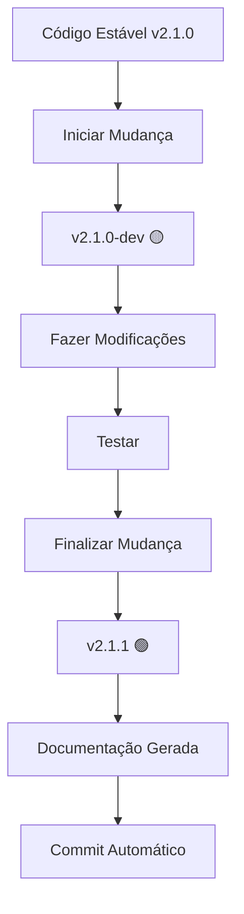

# 🎯 Sistema de Versionamento - Guia Rápido

Este arquivo explica de forma visual e prática como usar o sistema de versionamento implementado.

---

## 📊 Visão Geral



---

## 🚀 Quick Start (30 segundos)

### 1️⃣ Verificar Status Atual

```bash
python3 scripts/version_manager.py status
```

**Output:**
```
📊 Status do Versionamento
   Versão atual: 2.1.0 🟢
   Status: stable
```

### 2️⃣ Iniciar Mudança em Arquivo Crítico

```bash
python3 scripts/version_manager.py start app/models.py
```

**Output:**
```
🔧 Iniciando mudança em: app/models.py
✅ VERSION.md atualizado: 2.1.0-dev
✅ app/__init__.py atualizado: 2.1.0-dev
✅ app/models.py atualizado: 2.1.0-dev
🌿 Branch criada: dev/models-2025-12-27

✅ Mudança iniciada!
   Versão: 2.1.0-dev
   Arquivo: app/models.py

📝 Próximos passos:
   1. Fazer modificações no código
   2. Testar completamente
   3. Rodar: python3 scripts/version_manager.py finish app/models.py "descrição"
```

### 3️⃣ Fazer Modificações

```python
# Edite app/models.py normalmente
# Exemplo: adicionar campo Categoria
```

### 4️⃣ Finalizar Mudança

```bash
python3 scripts/version_manager.py finish app/models.py "Adiciona campo Categoria ao JournalEntry"
```

**Output:**
```
✅ Finalizando mudança em: app/models.py
✅ VERSION.md atualizado: 2.1.1
✅ app/__init__.py atualizado: 2.1.1
✅ app/models.py atualizado: 2.1.1
📄 Documentação gerada: 2025-12-27_models_adiciona-campo-categoria.md
📦 Commit criado: feat(models): Adiciona campo Categoria ao JournalEntry [v2.1.1]

🎉 Mudança finalizada com sucesso!
   Versão: 2.1.0 → 2.1.1
```

---

## 📁 Estrutura Criada

```
ProjetoFinancasV3/
├── .github/
│   └── copilot-instructions.md    ← 🤖 Regras para o AI (LEIA!)
│
├── .copilot-rules.md              ← 📋 Resumo rápido das regras
│
├── VERSION.md                     ← 📌 Versão atual do projeto
├── CHANGELOG.md                   ← 📚 Histórico de releases
├── CONTRIBUTING.md                ← 🤝 Guia completo de contribuição
│
├── changes/                       ← 📝 Mudanças pendentes
│   ├── TEMPLATE.md                   Template para docs
│   ├── 2025-12-27_models_*.md        Mudança em models.py
│   └── _history/                     Histórico arquivado
│       └── 2.1.0/
│
├── scripts/
│   ├── version_manager.py         ← 🛠️  Script principal
│   ├── pre-commit                 ← 🔒 Git hook de validação
│   └── install_hooks.sh           ← ⚙️  Instalador de hooks
│
└── app/
    ├── __init__.py                ← Contém __version__ = "2.1.0"
    ├── models.py                  ← 🔒 CRÍTICO - Versão: 2.1.0
    ├── config.py                  ← 🔒 CRÍTICO
    └── utils/
        ├── hasher.py              ← 🔒 CRÍTICO - Versão: 2.1.0
        └── ...
```

---

## 🎨 Estados de Versão Visual

| Estado | Badge | Descrição | Commit? |
|--------|-------|-----------|---------|
| **Stable** | `2.1.0 🟢` | Código testado e aprovado | ✅ Sim |
| **Development** | `2.1.0-dev 🟡` | Mudanças em progresso | ❌ Não |
| **Test** | `2.1.0-test 🟠` | Em fase de testes | ❌ Não |

---

## 📝 Comandos Disponíveis

### `status` - Ver situação atual

```bash
python3 scripts/version_manager.py status
```

### `start <arquivo>` - Iniciar mudança

```bash
python3 scripts/version_manager.py start app/models.py
```

### `finish <arquivo> "descrição"` - Finalizar mudança

```bash
python3 scripts/version_manager.py finish app/models.py "Adiciona campo X"
```

### `release [major|minor|patch]` - Criar release

```bash
# Bug fix: 2.1.0 → 2.1.1
python3 scripts/version_manager.py release patch

# Nova feature: 2.1.0 → 2.2.0
python3 scripts/version_manager.py release minor

# Breaking change: 2.1.0 → 3.0.0
python3 scripts/version_manager.py release major
```

### `rollback <tag>` - Reverter versão

```bash
python3 scripts/version_manager.py rollback v2.1.0
```

---

## 🔒 Arquivos Críticos (Versionamento Obrigatório)

Estes arquivos **requerem** uso do `version_manager.py`:

- ✅ `app/models.py` - Schema do banco
- ✅ `app/config.py` - Configurações
- ✅ `app/utils/hasher.py` - Geração de IDs
- ✅ `app/utils/normalizer.py` - Normalização
- ✅ `app/utils/deduplicator.py` - Deduplicação
- ✅ `app/blueprints/*/routes.py` - Lógica de negócio
- ✅ `app/blueprints/upload/processors/*.py` - Processadores

**Arquivos não-críticos** (templates, CSS, JS, docs) podem ser editados diretamente sem versionamento.

---

## 🛡️ Proteções Implementadas

### 1. Git Hook Pre-Commit

Bloqueia automaticamente commits de versões `-dev` ou `-test`:

```bash
# Instalação
./scripts/install_hooks.sh

# Ao tentar commitar versão -dev:
❌ COMMIT BLOQUEADO!
🚫 Versão em modo de desenvolvimento detectada: 2.1.0-dev
📄 Arquivo: VERSION.md

⚠️  Não é permitido commitar código com versão -dev ou -test.

✅ Para corrigir:
   1. Finalize a mudança: python3 scripts/version_manager.py finish <arquivo> "descrição"
```

### 2. Avisos no Startup (run.py)

Ao iniciar aplicação com versão `-dev`:

```
============================================================
  Sistema de Gestão Financeira
  Versão: 2.1.0-dev 🟡 (DESENVOLVIMENTO)
  ⚠️  AVISO: Código em desenvolvimento ativo
  ⚠️  Não commitar neste estado!
============================================================
```

---

## 📖 Documentação Gerada Automaticamente

Ao finalizar mudança com `finish`, é gerado arquivo em `changes/`:

**Exemplo:** `changes/2025-12-27_models_adiciona-campo-categoria.md`

```markdown
# Mudança: Adiciona campo Categoria ao JournalEntry

**Arquivo:** `app/models.py`
**Versão:** `2.1.0` → `2.1.1`
**Data:** 27/12/2025 14:30

## 📝 Descrição
Adiciona campo Categoria ao modelo JournalEntry para melhor classificação de transações.

## 📂 Arquivos Modificados
- `app/models.py`

## 🔄 Mudanças Realizadas
- [x] Adicionar campo `Categoria` (String, nullable)
- [x] Atualizar migration do banco

## 🧪 Testes Realizados
- [x] Upload de fatura testado
- [x] Campo salvo corretamente no banco

## 💥 Impacto
- [x] **Não** - Mudança mantém compatibilidade

## 🔙 Rollback
```bash
git checkout v2.1.0 -- app/models.py
```
```

---

## 🔄 Workflow Completo (Diagrama)

```
┌─────────────────────────────────────────────────────────┐
│  1. VERIFICAR STATUS                                    │
│  $ python3 scripts/version_manager.py status            │
│  → Versão atual: 2.1.0 🟢                               │
└─────────────────────────────────────────────────────────┘
                        ↓
┌─────────────────────────────────────────────────────────┐
│  2. INICIAR MUDANÇA                                     │
│  $ python3 scripts/version_manager.py start models.py   │
│  → Versão: 2.1.0-dev 🟡                                 │
│  → Branch: dev/models-2025-12-27                        │
└─────────────────────────────────────────────────────────┘
                        ↓
┌─────────────────────────────────────────────────────────┐
│  3. FAZER MODIFICAÇÕES                                  │
│  → Editar app/models.py                                 │
│  → Adicionar campo Categoria                            │
└─────────────────────────────────────────────────────────┘
                        ↓
┌─────────────────────────────────────────────────────────┐
│  4. TESTAR                                              │
│  $ python3 run.py                                       │
│  → ⚠️  Aviso: versão -dev no console                    │
│  → Testar funcionalidade manualmente                    │
└─────────────────────────────────────────────────────────┘
                        ↓
┌─────────────────────────────────────────────────────────┐
│  5. FINALIZAR MUDANÇA                                   │
│  $ python3 scripts/version_manager.py finish \          │
│    app/models.py "Adiciona campo Categoria"             │
│  → Versão: 2.1.1 🟢                                     │
│  → Doc gerada em changes/                               │
│  → Commit criado automaticamente                        │
└─────────────────────────────────────────────────────────┘
                        ↓
┌─────────────────────────────────────────────────────────┐
│  6. PUSH PARA GIT                                       │
│  $ git push origin main                                 │
│  → ✅ Hook permite commit (versão stable)               │
└─────────────────────────────────────────────────────────┘
```

---

## 🚨 Troubleshooting Rápido

### ❌ "Comando python não encontrado"

**Solução:** Use `python3` em vez de `python`

```bash
python3 scripts/version_manager.py status
```

### ❌ "Permission denied"

**Solução:** Torne scripts executáveis

```bash
chmod +x scripts/version_manager.py scripts/install_hooks.sh
```

### ❌ "COMMIT BLOQUEADO"

**Solução:** Finalize mudança antes de commitar

```bash
python3 scripts/version_manager.py finish app/models.py "Descrição"
```

### ❌ "Esqueci de rodar start"

**Solução:** Crie documentação manualmente

```bash
cp changes/TEMPLATE.md changes/2025-12-27_models_minha-mudanca.md
# Edite arquivo e preencha seções
# Atualize versão manualmente no docstring do arquivo
```

---

## 📚 Documentação Adicional

- **Instruções completas para AI:** [.github/copilot-instructions.md](.github/copilot-instructions.md)
- **Guia de contribuição:** [CONTRIBUTING.md](CONTRIBUTING.md)
- **Histórico de mudanças:** [CHANGELOG.md](CHANGELOG.md)
- **Status do projeto:** [STATUSPROJETO.md](STATUSPROJETO.md)
- **Bugs conhecidos:** [BUGS.md](BUGS.md)

---

## 🎯 Checklist de Uso Diário

**Ao começar a trabalhar no projeto:**

- [ ] Ler [.github/copilot-instructions.md](.github/copilot-instructions.md)
- [ ] Rodar `python3 scripts/version_manager.py status`
- [ ] Verificar versão atual antes de modificar

**Ao modificar arquivo crítico:**

- [ ] Rodar `start <arquivo>`
- [ ] Fazer modificações
- [ ] Testar completamente
- [ ] Rodar `finish <arquivo> "descrição"`
- [ ] Verificar doc gerada em `changes/`

**Ao fazer release:**

- [ ] Todas mudanças finalizadas (sem -dev/-test)
- [ ] Docs em `changes/` completas
- [ ] Rodar `release [patch|minor|major]`
- [ ] Push de commits e tags para git

---

## 💡 Dicas Importantes

1. **Sempre leia as instruções do AI** antes de começar ([.github/copilot-instructions.md](.github/copilot-instructions.md))

2. **Não commite versões -dev/-test** na main (hook vai bloquear)

3. **Documente suas mudanças** - o template em `changes/TEMPLATE.md` é seu guia

4. **Teste antes de finalizar** - não há volta fácil depois do commit

5. **Use release regularmente** - não acumule muitas mudanças

6. **Mantenha BUGS.md** como referência histórica (não precisa mais usar para novos bugs)

---

**Sistema implementado em:** 27/12/2025  
**Versão do sistema:** 1.0.0  
**Status:** ✅ Totalmente funcional
