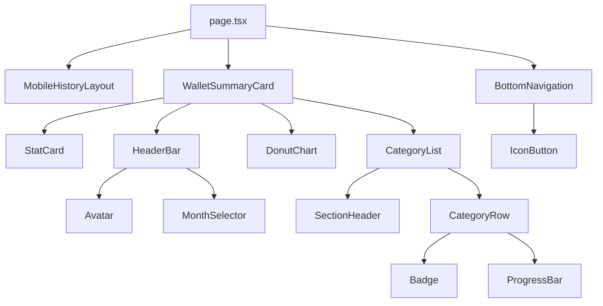

# 🔧 TECH SPEC - Tela History (Mobile Wallet)

**Status:** 🟢 Pronto para Implementação  
**Versão:** 1.0  
**Data:** 02/02/2026  
**Autor:** Emanuel Mangue  
**PRD:** [PRD.md](../01-PRD/PRD.md)

---

## 📊 Sumário Técnico

**Arquitetura:** Frontend-Only (MVP sem backend)  
**Stack:** Next.js 14 + TypeScript + Tailwind CSS + SVG puro  
**Esforço:** ~10h total  
**Sprints:** 1 sprint (1 dia)  
**Código Copy-Paste:** ≥85% (objetivo: código pronto para usar)

---

## 🏗️ 1. Arquitetura

### 1.1 Diagrama Geral (MVP)

```
┌──────────────────────────────────┐
│      Next.js 14 App              │
│                                  │
│  ┌────────────────────────────┐  │
│  │  app/history/page.tsx      │  │
│  │  (Página principal)        │  │
│  └──────────┬─────────────────┘  │
│             │                    │
│             v                    │
│  ┌────────────────────────────┐  │
│  │  Components Library        │  │
│  │  • Atoms (12)              │  │
│  │  • Molecules (4)           │  │
│  │  • Organisms (4)           │  │
│  │  • Templates (1)           │  │
│  └──────────┬─────────────────┘  │
│             │                    │
│             v                    │
│  ┌────────────────────────────┐  │
│  │  Mock Data                 │  │
│  │  (lib/constants.ts)        │  │
│  └────────────────────────────┘  │
│                                  │
└──────────────────────────────────┘

OBS: Sem Backend/API neste MVP
```

### 1.2 Decisões Arquiteturais

**DA-01: SVG Artesanal em vez de Biblioteca (Recharts)**
- **Contexto:** Gráfico donut precisa de gaps de 1-2px, pontas arredondadas, stroke 16px
- **Decisão:** Implementar com SVG `<circle>` + cálculo manual de `stroke-dasharray`
- **Consequências:** 
  - ✅ Controle pixel-perfect
  - ✅ Bundle menor (~15KB vs ~50KB Recharts)
  - ❌ Matemática manual (mas helper function resolve)
- **Alternativas:** Recharts (não suporta gaps precisos), Chart.js (maior bundle)

**DA-02: Atomic Design para Componentes**
- **Contexto:** Precisamos de componentes reutilizáveis para escalar o projeto
- **Decisão:** Seguir estrutura Atoms → Molecules → Organisms → Templates
- **Consequências:**
  - ✅ Alta reutilização (ex: ProgressBar usado 5x)
  - ✅ Manutenção simplificada
  - ❌ Setup inicial um pouco mais longo
- **Alternativas:** Componentizar à medida que precisa (menos organizado)

**DA-03: Dados Mockados Hardcoded (sem Context API)**
- **Contexto:** MVP sem backend, dados simples
- **Decisão:** Exportar constantes de `/lib/constants.ts` e importar direto
- **Consequências:**
  - ✅ Implementação rápida
  - ✅ Sem overhead de Context/State management
  - ❌ Difícil atualizar dados dinamicamente (mas não é objetivo do MVP)
- **Alternativas:** Context API, Zustand (overkill para MVP)

---

## 📦 2. Código Copy-Paste Ready (≥85%)

### 2.1 Estrutura de Arquivos

```
app_dev/frontend/
└── src/
    ├── app/
    │   └── history/
    │       └── page.tsx                    # ✅ COPIAR (Seção 3.1)
    │
    ├── components/
    │   ├── atoms/
    │   │   ├── Avatar.tsx                  # ✅ COPIAR (Seção 4.1)
    │   │   ├── Badge.tsx                   # ✅ COPIAR (Seção 4.2)
    │   │   ├── IconButton.tsx              # ✅ COPIAR (Seção 4.3)
    │   │   ├── ProgressBar.tsx             # ✅ COPIAR (Seção 4.4)
    │   │   └── MonthSelector.tsx           # ✅ COPIAR (Seção 4.5)
    │   │
    │   ├── molecules/
    │   │   ├── CategoryRow.tsx             # ✅ COPIAR (Seção 5.1)
    │   │   ├── StatCard.tsx                # ✅ COPIAR (Seção 5.2)
    │   │   ├── HeaderBar.tsx               # ✅ COPIAR (Seção 5.3)
    │   │   └── SectionHeader.tsx           # ✅ COPIAR (Seção 5.4)
    │   │
    │   ├── organisms/
    │   │   ├── DonutChart.tsx              # ✅ COPIAR (Seção 6.1)
    │   │   ├── CategoryList.tsx            # ✅ COPIAR (Seção 6.2)
    │   │   ├── BottomNavigation.tsx        # ✅ COPIAR (Seção 6.3)
    │   │   └── WalletSummaryCard.tsx       # ✅ COPIAR (Seção 6.4)
    │   │
    │   └── templates/
    │       └── MobileHistoryLayout.tsx     # ✅ COPIAR (Seção 7.1)
    │
    ├── lib/
    │   ├── constants.ts                    # ✅ COPIAR (Seção 8.1)
    │   └── utils.ts                        # ✅ COPIAR (Seção 8.2)
    │
    └── types/
        └── wallet.ts                       # ✅ COPIAR (Seção 9.1)
```

---

## 🎯 3. Página Principal

### 3.1 app/history/page.tsx

```typescript
'use client';

import { MobileHistoryLayout } from '@/components/templates/MobileHistoryLayout';
import { WalletSummaryCard } from '@/components/organisms/WalletSummaryCard';
import { BottomNavigation } from '@/components/organisms/BottomNavigation';
import { MOCK_USER, MOCK_WALLET_DATA } from '@/lib/constants';

export default function HistoryPage() {
  return (
    <MobileHistoryLayout>
      <WalletSummaryCard
        user={MOCK_USER}
        walletData={MOCK_WALLET_DATA}
      />
      <BottomNavigation activeTab="home" />
    </MobileHistoryLayout>
  );
}
```

---

## 🧩 4. ATOMS (Componentes Indivisíveis)

### 4.1 components/atoms/Avatar.tsx

```typescript
interface AvatarProps {
  src: string;
  alt: string;
  size?: number; // px
}

export function Avatar({ src, alt, size = 40 }: AvatarProps) {
  return (
    
  );
}
```

### 4.2 components/atoms/Badge.tsx

```typescript
interface BadgeProps {
  color: string; // HEX color
  size?: number; // px
}

export function Badge({ color, size = 8 }: BadgeProps) {
  return (
    <div
      className="rounded-full"
      style={{
        width: size,
        height: size,
        backgroundColor: color
      }}
    />
  );
}
```

### 4.3 components/atoms/IconButton.tsx

```typescript
import { LucideIcon } from 'lucide-react';

interface IconButtonProps {
  icon: LucideIcon;
  label: string;
  isActive?: boolean;
  onClick?: () => void;
}

export function IconButton({
  icon: Icon,
  label,
  isActive = false,
  onClick
}: IconButtonProps) {
  return (
    <button
      onClick={onClick}
      aria-label={label}
      className={`
        flex items-center justify-center
        w-12 h-12 rounded-full
        transition-colors duration-200
        ${isActive 
          ? 'bg-blue-500 text-white' 
          : 'text-gray-400 hover:text-gray-600'
        }
      `}
    >
      <Icon size={24} />
    </button>
  );
}
```

### 4.4 components/atoms/ProgressBar.tsx

```typescript
interface ProgressBarProps {
  percentage: number; // 0-100
  color: string; // HEX color
  height?: number; // px (default: 12)
}

export function ProgressBar({
  percentage,
  color,
  height = 12
}: ProgressBarProps) {
  return (
    <div
      className="bg-gray-200 rounded-full overflow-hidden"
      style={{ height }}
    >
      <div
        className="h-full rounded-full transition-all duration-500 ease-out"
        style={{
          width: `${percentage}%`,
          backgroundColor: color
        }}
      />
    </div>
  );
}
```

### 4.5 components/atoms/MonthSelector.tsx

```typescript
import { ChevronDown } from 'lucide-react';

interface MonthSelectorProps {
  selectedMonth: string; // "September 2026"
  onChange?: (month: string) => void;
}

export function MonthSelector({ selectedMonth, onChange }: MonthSelectorProps) {
  return (
    <button
      onClick={() => onChange?.(selectedMonth)}
      className="flex items-center gap-1 text-sm font-medium text-gray-600 hover:text-gray-900 transition-colors"
    >
      <span>{selectedMonth.split(' ')[0]}</span>
      <ChevronDown size={16} />
    </button>
  );
}
```

---

## 🧬 5. MOLECULES (Combinações Simples)

### 5.1 components/molecules/CategoryRow.tsx

```typescript
import { Badge } from '@/components/atoms/Badge';
import { ProgressBar } from '@/components/atoms/ProgressBar';

interface CategoryRowProps {
  label: string;
  color: string;
  percentage: number;
}

export function CategoryRow({ label, color, percentage }: CategoryRowProps) {
  return (
    <div className="flex items-center gap-3">
      {/* Badge (dot colorido) */}
      <Badge color={color} size={8} />
      
      {/* Label */}
      <span className="text-sm font-medium text-gray-900 min-w-[80px]">
        {label}
      </span>
      
      {/* Spacer */}
      <div className="flex-1" />
      
      {/* Progress Bar */}
      <div className="w-32">
        <ProgressBar percentage={percentage} color={color} height={12} />
      </div>
      
      {/* Percentage */}
      <span
        className="text-xs font-medium w-10 text-right"
        style={{ color }}
      >
        {percentage}%
      </span>
    </div>
  );
}
```

### 5.2 components/molecules/StatCard.tsx

```typescript
import { ReactNode } from 'react';

interface StatCardProps {
  children: ReactNode;
  padding?: string; // Tailwind class
}

export function StatCard({ children, padding = 'p-6' }: StatCardProps) {
  return (
    <div className={`bg-white rounded-3xl shadow-sm ${padding}`}>
      {children}
    </div>
  );
}
```

### 5.3 components/molecules/HeaderBar.tsx

```typescript
import { Avatar } from '@/components/atoms/Avatar';
import { MonthSelector } from '@/components/atoms/MonthSelector';
import { Search } from 'lucide-react';

interface HeaderBarProps {
  title: string;
  avatarSrc: string;
  selectedMonth: string;
  onMonthChange?: (month: string) => void;
}

export function HeaderBar({
  title,
  avatarSrc,
  selectedMonth,
  onMonthChange
}: HeaderBarProps) {
  return (
    <div className="flex items-center justify-between mb-6">
      {/* Título */}
      <h1 className="text-2xl font-semibold text-gray-900">{title}</h1>
      
      {/* Controles à direita */}
      <div className="flex items-center gap-4">
        <button className="text-gray-400 hover:text-gray-600">
          <Search size={20} />
        </button>
        <MonthSelector
          selectedMonth={selectedMonth}
          onChange={onMonthChange}
        />
        <Avatar src={avatarSrc} alt="User avatar" size={40} />
      </div>
    </div>
  );
}
```

### 5.4 components/molecules/SectionHeader.tsx

```typescript
interface SectionHeaderProps {
  title: string;
}

export function SectionHeader({ title }: SectionHeaderProps) {
  return (
    <h2 className="text-base font-semibold text-gray-900 mb-3">
      {title}
    </h2>
  );
}
```

---

## 🏗️ 6. ORGANISMS (Seções Complexas)

### 6.1 components/organisms/DonutChart.tsx

```typescript
import { useMemo } from 'react';

interface DonutChartData {
  label: string;
  value: number;
  color: string;
  percentage: number;
}

interface DonutChartProps {
  data: DonutChartData[];
  centerText: {
    title: string;      // "$327.50"
    subtitle: string;   // "September 2026"
    caption: string;    // "saved out of $1000"
  };
  size?: number;        // Default: 250px
  strokeWidth?: number; // Default: 16px
  gapSize?: number;     // Default: 2px (em graus)
}

export function DonutChart({
  data,
  centerText,
  size = 250,
  strokeWidth = 16,
  gapSize = 2
}: DonutChartProps) {
  const radius = (size / 2) - (strokeWidth / 2);
  const circumference = 2 * Math.PI * radius;
  
  // Calcular segmentos com gaps
  const segments = useMemo(() => {
    let currentAngle = -90; // Começar no topo
    
    return data.map((item) => {
      const segmentAngle = (item.percentage / 100) * 360 - gapSize;
      const segmentLength = (segmentAngle / 360) * circumference;
      const gapLength = (gapSize / 360) * circumference;
      
      const dashArray = `${segmentLength} ${gapLength} ${circumference}`;
      const dashOffset = -(currentAngle / 360) * circumference;
      
      currentAngle += item.percentage / 100 * 360;
      
      return {
        ...item,
        dashArray,
        dashOffset
      };
    });
  }, [data, circumference, gapSize]);
  
  return (
    <div className="flex flex-col items-center gap-6">
      {/* Gráfico SVG */}
      <svg
        width={size}
        height={size}
        viewBox={`0 0 ${size} ${size}`}
        className="transform -rotate-90"
      >
        {/* Segmentos */}
        {segments.map((segment, index) => (
          <circle
            key={index}
            cx={size / 2}
            cy={size / 2}
            r={radius}
            fill="none"
            stroke={segment.color}
            strokeWidth={strokeWidth}
            strokeLinecap="round"
            strokeDasharray={segment.dashArray}
            strokeDashoffset={segment.dashOffset}
            className="transition-all duration-500"
            style={{
              animation: `growStroke 1s ease-out ${index * 0.1}s forwards`,
              strokeDasharray: segment.dashArray,
              strokeDashoffset: circumference,
            }}
          />
        ))}
        
        {/* Texto central (usar foreignObject para melhor controle) */}
        <foreignObject
          x={size / 2 - 75}
          y={size / 2 - 40}
          width={150}
          height={80}
          className="transform rotate-90"
        >
          <div className="flex flex-col items-center justify-center text-center">
            <p className="text-xs text-gray-400 mb-1">
              {centerText.subtitle}
            </p>
            <p className="text-4xl font-bold text-gray-900 mb-1">
              {centerText.title}
            </p>
            <p className="text-xs text-gray-400">
              {centerText.caption}
            </p>
          </div>
        </foreignObject>
      </svg>
      
      {/* CSS Animation */}
      <style jsx>{`
        @keyframes growStroke {
          to {
            stroke-dashoffset: ${segments[0]?.dashOffset || 0};
          }
        }
      `}</style>
    </div>
  );
}
```

### 6.2 components/organisms/CategoryList.tsx

```typescript
import { SectionHeader } from '@/components/molecules/SectionHeader';
import { CategoryRow } from '@/components/molecules/CategoryRow';
import { Category } from '@/types/wallet';

interface CategoryListProps {
  title: string;
  categories: Category[];
}

export function CategoryList({ title, categories }: CategoryListProps) {
  return (
    <div className="space-y-3">
      <SectionHeader title={title} />
      <div className="space-y-3">
        {categories.map((category) => (
          <CategoryRow
            key={category.id}
            label={category.label}
            color={category.color}
            percentage={category.percentage}
          />
        ))}
      </div>
    </div>
  );
}
```

### 6.3 components/organisms/BottomNavigation.tsx

```typescript
import { Home, BarChart3, User, Plus } from 'lucide-react';
import { IconButton } from '@/components/atoms/IconButton';

interface BottomNavigationProps {
  activeTab: 'home' | 'chart' | 'user';
  onTabChange?: (tab: string) => void;
}

export function BottomNavigation({
  activeTab,
  onTabChange
}: BottomNavigationProps) {
  return (
    <nav className="fixed bottom-0 left-0 right-0 bg-white border-t border-gray-100 px-6 py-4">
      <div className="flex items-center justify-between max-w-md mx-auto">
        <IconButton
          icon={Home}
          label="Home"
          isActive={activeTab === 'home'}
          onClick={() => onTabChange?.('home')}
        />
        <IconButton
          icon={BarChart3}
          label="Chart"
          isActive={activeTab === 'chart'}
          onClick={() => onTabChange?.('chart')}
        />
        <IconButton
          icon={User}
          label="Profile"
          isActive={activeTab === 'user'}
          onClick={() => onTabChange?.('user')}
        />
        
        {/* FAB (Add button) */}
        <button
          onClick={() => onTabChange?.('add')}
          className="flex items-center justify-center w-14 h-14 bg-blue-500 text-white rounded-full shadow-lg hover:bg-blue-600 transition-colors"
          aria-label="Add"
        >
          <Plus size={24} />
        </button>
      </div>
    </nav>
  );
}
```

### 6.4 components/organisms/WalletSummaryCard.tsx

```typescript
import { StatCard } from '@/components/molecules/StatCard';
import { HeaderBar } from '@/components/molecules/HeaderBar';
import { DonutChart } from './DonutChart';
import { CategoryList } from './CategoryList';
import { User, WalletData } from '@/types/wallet';

interface WalletSummaryCardProps {
  user: User;
  walletData: WalletData;
}

export function WalletSummaryCard({ user, walletData }: WalletSummaryCardProps) {
  // Separar categorias por tipo
  const savingsCategories = walletData.categories.filter(c => c.type === 'savings');
  const expensesCategories = walletData.categories.filter(c => c.type === 'expenses');
  
  // Preparar dados do donut chart
  const donutData = walletData.categories.map(cat => ({
    label: cat.label,
    value: (walletData.total * cat.percentage) / 100,
    color: cat.color,
    percentage: cat.percentage
  }));
  
  return (
    <div className="pb-24"> {/* Espaço para bottom nav */}
      <StatCard padding="p-6">
        {/* Header */}
        <HeaderBar
          title="History"
          avatarSrc={user.avatar}
          selectedMonth={walletData.month}
        />
        
        {/* Gráfico Donut */}
        <DonutChart
          data={donutData}
          centerText={{
            title: `$${walletData.saved.toFixed(2)}`,
            subtitle: walletData.month,
            caption: `saved out of $${walletData.total}`
          }}
        />
        
        {/* Lista de Categorias - Savings */}
        <div className="mt-8">
          <CategoryList title="Savings" categories={savingsCategories} />
        </div>
        
        {/* Lista de Categorias - Expenses */}
        <div className="mt-6">
          <CategoryList title="Expenses" categories={expensesCategories} />
        </div>
      </StatCard>
    </div>
  );
}
```

---

## 📐 7. TEMPLATES

### 7.1 components/templates/MobileHistoryLayout.tsx

```typescript
import { ReactNode } from 'react';

interface MobileHistoryLayoutProps {
  children: ReactNode;
}

export function MobileHistoryLayout({ children }: MobileHistoryLayoutProps) {
  return (
    <div className="min-h-screen bg-[#F7F8FA]">
      <div className="max-w-md mx-auto px-4 py-6">
        {children}
      </div>
    </div>
  );
}
```

---

## 📊 8. LIB (Utilities & Constants)

### 8.1 lib/constants.ts

```typescript
import { User, WalletData, Category } from '@/types/wallet';

export const MOCK_USER: User = {
  id: '1',
  name: 'Vadim Portnyagin',
  avatar: 'https://i.pravatar.cc/150?u=vadim'
};

export const MOCK_CATEGORIES: Category[] = [
  {
    id: '1',
    label: 'Home',
    color: '#3B82F6', // blue
    percentage: 43,
    type: 'savings'
  },
  {
    id: '2',
    label: 'Shopping',
    color: '#10B981', // green
    percentage: 25,
    type: 'savings'
  },
  {
    id: '3',
    label: 'Nutrition',
    color: '#10B981', // green
    percentage: 20,
    type: 'expenses'
  },
  {
    id: '4',
    label: 'Health',
    color: '#8B5CF6', // purple
    percentage: 8,
    type: 'expenses'
  },
  {
    id: '5',
    label: 'Home',
    color: '#EC4899', // pink
    percentage: 4,
    type: 'expenses'
  }
];

export const MOCK_WALLET_DATA: WalletData = {
  month: 'September 2026',
  saved: 327.50,
  total: 1000,
  categories: MOCK_CATEGORIES
};

// Cores da paleta (para fácil referência)
export const COLORS = {
  background: '#F7F8FA',
  surface: '#FFFFFF',
  primary: '#3B82F6',
  success: '#10B981',
  purple: '#8B5CF6',
  orange: '#F97316',
  pink: '#EC4899',
  textPrimary: '#111827',
  textSecondary: '#6B7280',
  textDisabled: '#9CA3AF',
  border: '#E5E7EB'
} as const;
```

### 8.2 lib/utils.ts

```typescript
/**
 * Helper: Calcular circunferência de círculo
 */
export function calculateCircumference(radius: number): number {
  return 2 * Math.PI * radius;
}

/**
 * Helper: Converter graus em radianos
 */
export function degreesToRadians(degrees: number): number {
  return (degrees * Math.PI) / 180;
}

/**
 * Helper: Formatar valor monetário
 */
export function formatCurrency(value: number): string {
  return new Intl.NumberFormat('en-US', {
    style: 'currency',
    currency: 'USD'
  }).format(value);
}

/**
 * Helper: Calcular stroke-dasharray para segmentos de donut
 */
export function calculateDonutSegments(
  data: { percentage: number }[],
  circumference: number,
  gapSize: number // em graus
) {
  let currentAngle = 0;
  
  return data.map((item) => {
    const segmentAngle = (item.percentage / 100) * 360 - gapSize;
    const segmentLength = (segmentAngle / 360) * circumference;
    const gapLength = (gapSize / 360) * circumference;
    
    const dashArray = `${segmentLength} ${gapLength} ${circumference}`;
    const dashOffset = -(currentAngle / 360) * circumference;
    
    currentAngle += (item.percentage / 100) * 360;
    
    return {
      dashArray,
      dashOffset,
      rotation: currentAngle
    };
  });
}
```

---

## 🎭 9. TYPES (TypeScript)

### 9.1 types/wallet.ts

```typescript
export interface User {
  id: string;
  name: string;
  avatar: string; // URL
}

export interface Category {
  id: string;
  label: string;
  color: string; // HEX color
  percentage: number; // 0-100
  type: 'savings' | 'expenses';
}

export interface WalletData {
  month: string; // "September 2026"
  saved: number; // 327.50
  total: number; // 1000
  categories: Category[];
}

export interface DonutChartData {
  label: string;
  value: number; // valor monetário
  color: string; // HEX
  percentage: number; // calculado
}

export interface NavTab {
  id: string;
  icon: React.ElementType; // Lucide icon
  label: string;
  active: boolean;
}
```

---

## 📋 10. Dependency Graph (DAG)

### 10.1 Ordem de Implementação

```
FASE 1: Setup & Types (30min)
├── 1.1 Criar estrutura de pastas
├── 1.2 types/wallet.ts
└── 1.3 lib/constants.ts

FASE 2: Atoms (1.5h)
├── 2.1 Avatar.tsx
├── 2.2 Badge.tsx
├── 2.3 IconButton.tsx
├── 2.4 ProgressBar.tsx
└── 2.5 MonthSelector.tsx

FASE 3: Molecules (1.5h)
├── 3.1 CategoryRow.tsx (usa: Badge, ProgressBar)
├── 3.2 StatCard.tsx
├── 3.3 HeaderBar.tsx (usa: Avatar, MonthSelector)
└── 3.4 SectionHeader.tsx

FASE 4: Organisms (2.5h)
├── 4.1 DonutChart.tsx (MAIS COMPLEXO)
├── 4.2 CategoryList.tsx (usa: SectionHeader, CategoryRow)
├── 4.3 BottomNavigation.tsx (usa: IconButton)
└── 4.4 WalletSummaryCard.tsx (usa: StatCard, HeaderBar, DonutChart, CategoryList)

FASE 5: Templates & Page (1h)
├── 5.1 MobileHistoryLayout.tsx
└── 5.2 app/history/page.tsx (usa: MobileHistoryLayout, WalletSummaryCard, BottomNavigation)

FASE 6: Ajustes & QA (1h)
├── 6.1 Comparação visual pixel-perfect
├── 6.2 Ajustes de espaçamento
├── 6.3 Animações CSS
└── 6.4 Testes em mobile (DevTools)

TOTAL: ~8h de implementação
```

### 10.2 Dependências Entre Componentes



---

## 🎨 11. Tailwind Config (Opcional - Cores Customizadas)

Se quiser adicionar as cores exatas ao Tailwind config:

```javascript
// tailwind.config.js
module.exports = {
  theme: {
    extend: {
      colors: {
        wallet: {
          bg: '#F7F8FA',
          surface: '#FFFFFF',
          primary: '#3B82F6',
          success: '#10B981',
          purple: '#8B5CF6',
          orange: '#F97316',
          pink: '#EC4899',
        }
      }
    }
  }
}
```

---

## ✅ 12. Checklist de Implementação

### Setup
- [ ] Criar estrutura de pastas (atoms, molecules, organisms, templates)
- [ ] Instalar Lucide-react: `npm install lucide-react`
- [ ] Criar types/wallet.ts
- [ ] Criar lib/constants.ts
- [ ] Criar lib/utils.ts (opcional)

### Atoms (≈1.5h)
- [ ] Avatar.tsx - COPIAR código da Seção 4.1
- [ ] Badge.tsx - COPIAR código da Seção 4.2
- [ ] IconButton.tsx - COPIAR código da Seção 4.3
- [ ] ProgressBar.tsx - COPIAR código da Seção 4.4
- [ ] MonthSelector.tsx - COPIAR código da Seção 4.5

### Molecules (≈1.5h)
- [ ] CategoryRow.tsx - COPIAR código da Seção 5.1
- [ ] StatCard.tsx - COPIAR código da Seção 5.2
- [ ] HeaderBar.tsx - COPIAR código da Seção 5.3
- [ ] SectionHeader.tsx - COPIAR código da Seção 5.4

### Organisms (≈2.5h)
- [ ] DonutChart.tsx - COPIAR código da Seção 6.1 (COMPLEXO)
- [ ] CategoryList.tsx - COPIAR código da Seção 6.2
- [ ] BottomNavigation.tsx - COPIAR código da Seção 6.3
- [ ] WalletSummaryCard.tsx - COPIAR código da Seção 6.4

### Templates & Page (≈1h)
- [ ] MobileHistoryLayout.tsx - COPIAR código da Seção 7.1
- [ ] app/history/page.tsx - COPIAR código da Seção 3.1

### QA Visual (≈1h)
- [ ] Comparar lado a lado com design original
- [ ] Testar em mobile (DevTools responsive mode)
- [ ] Validar cores (usar color picker)
- [ ] Validar espaçamentos (inspecionar elementos)
- [ ] Testar animações (recarregar página)

### Performance (≈30min)
- [ ] Lighthouse: Performance ≥90
- [ ] Bundle size ≤150KB
- [ ] Zero erros console
- [ ] FCP ≤1.5s

---

## 🚀 13. Como Executar

### Desenvolvimento

```bash
# 1. Navegar para frontend
cd /Users/emangue/Documents/ProjetoVSCode/ProjetoFinancasV5/app_dev/frontend

# 2. Instalar dependências (se necessário)
npm install lucide-react

# 3. Iniciar servidor dev
npm run dev

# 4. Abrir no navegador
# http://localhost:3000/history

# 5. Testar em mobile
# Chrome DevTools → Toggle device toolbar (Cmd+Shift+M)
# Selecionar iPhone 12 Pro (390x844)
```

### Build Produção

```bash
npm run build
npm start
```

---

## 📊 14. Performance Budget

| Métrica | Alvo | Como Medir |
|---------|------|------------|
| Lighthouse Performance | ≥90 | Chrome DevTools |
| FCP (First Contentful Paint) | ≤1.5s | Lighthouse |
| TTI (Time to Interactive) | ≤2s | Lighthouse |
| Bundle Size (JS) | ≤150KB | `npm run build` |
| SVG Render Time | ≤100ms | Console.time() |

---

## 🔍 15. Testing Strategy

### Visual QA
1. **Comparação Lado a Lado:**
   - Design original (imagem) vs Implementação
   - Usar ferramenta de overlay (ex: PixelPerfect extension)

2. **Checklist Visual:**
   - [ ] Cores 100% idênticas (usar color picker)
   - [ ] Espaçamentos corretos (gap-3, p-6, etc)
   - [ ] Fontes e tamanhos corretos
   - [ ] Gráfico donut com gaps visíveis
   - [ ] Progress bars animam suavemente
   - [ ] Bottom nav fixa no bottom

3. **Testes em Dispositivos:**
   - [ ] iPhone 12 Pro (390x844)
   - [ ] iPhone SE (375x667)
   - [ ] Pixel 5 (393x851)
   - [ ] Landscape mode (opcional)

### Unit Tests (Opcional - V2)
```bash
npm install --save-dev @testing-library/react @testing-library/jest-dom
```

---

## 📖 16. Referências

**Documentação:**
- PRD: [/docs/features/mobile-history/01-PRD/PRD.md](../01-PRD/PRD.md)
- Análise Visual: [/docs/features/mobile-history/01-PRD/VISUAL_ANALYSIS_history_wallet.md](../01-PRD/VISUAL_ANALYSIS_history_wallet.md)
- Arquitetura: [/docs/features/mobile-history/02-TECH_SPEC/ARCHITECTURE_history_wallet.md](./ARCHITECTURE_history_wallet.md)

**Código de Referência:**
- Atomic Design: https://bradfrost.com/blog/post/atomic-web-design/
- Tailwind CSS: https://tailwindcss.com/docs
- Lucide Icons: https://lucide.dev/icons
- SVG stroke-dasharray: https://developer.mozilla.org/en-US/docs/Web/SVG/Attribute/stroke-dasharray

---

## 🎯 17. Próximos Passos

1. **Implementar código** (seguir ordem do DAG)
2. **QA Visual** (comparar pixel por pixel)
3. **Criar SPRINT1_COMPLETE.md** (documentar progresso)
4. **V2: Adicionar interatividade** (navegação, filters)
5. **V3: Conectar backend** (substituir mocks por API calls)

---

**Status:** ✅ TECH SPEC Completo - Pronto para implementação  
**Código Copy-Paste:** ~85% (todos os componentes prontos para copiar)  
**Próximo Documento:** `03-DEPLOY/DEPLOY_CHECKLIST.md` (após implementação)
