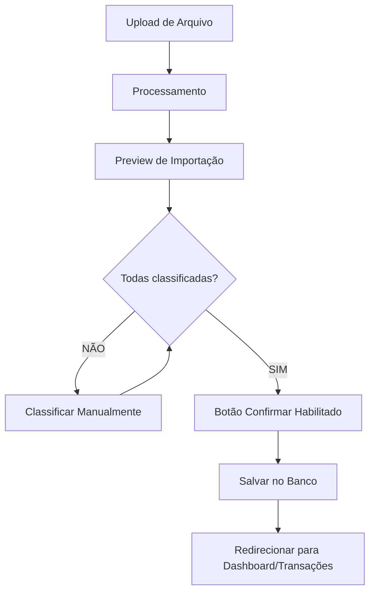

# 📄 Funcionalidades da Tela de Preview de Importação

## 📋 Visão Geral

A tela de **Preview de Importação** é o último passo antes de confirmar a importação de um arquivo financeiro (CSV, Excel, PDF). Ela permite que o usuário revise, classifique e valide todas as transações detectadas antes de salvá-las definitivamente no sistema.

---

## 🎯 Objetivo Principal

Garantir que **todas as transações sejam classificadas corretamente** antes da importação, evitando:
- ❌ Transações sem grupo/subgrupo
- ❌ Duplicatas não detectadas
- ❌ Classificações incorretas
- ❌ Valores errados

---

## 🧩 Componentes da Tela

### 1. **Cabeçalho**
```
Preview de Importação
Revise os dados antes de confirmar a importação
```

**Funcionalidades:**
- ✅ Título descritivo da etapa atual
- ✅ Instrução clara do que o usuário deve fazer
- ✅ Botão "Cancelar" (canto superior direito) - descarta importação e volta à tela anterior

---

### 2. **⚠️ Alerta de Transações Sem Classificação**

```
⚠️ 19 transações sem classificação
Complete a classificação antes de confirmar a importação. 39 de 58 transações já classificadas.
```

**Funcionalidades:**
- ✅ **Indicador visual** de problemas que precisam ser resolvidos
- ✅ **Contador de progresso:** mostra quantas transações estão classificadas (39/58)
- ✅ **Bloqueio de importação:** sistema não permite confirmar enquanto houver transações sem classificação
- ✅ **Cor de destaque:** fundo amarelo/laranja para chamar atenção

**Regra de Negócio:**
- Se `transações sem classificação > 0` → mostrar alerta
- Botão "Confirmar Importação" deve estar **desabilitado** até todas estarem classificadas

---

### 3. **📊 Informações do Arquivo**

Seção que resume os metadados do arquivo importado.

#### 3.1 **Banco**
```
Banco: Itaú
```
- Detectado automaticamente pelo processador
- Determina qual parser usar (Itaú, Nubank, Bradesco, etc.)

#### 3.2 **Cartão**
```
Cartão: 9266
```
- Últimos 4 dígitos do cartão (para faturas de crédito)
- Para extratos bancários: pode mostrar "Conta Corrente" ou número da conta

#### 3.3 **Arquivo**
```
Arquivo: fatura-202601.csv
```
- Nome original do arquivo enviado
- Importante para rastreabilidade e histórico

#### 3.4 **Mês Fatura**
```
Mês Fatura: fevereiro de 2026
```
- Mês de referência da fatura/extrato
- Usado para filtros e organização temporal
- Para faturas: mês do fechamento
- Para extratos: período coberto pelo arquivo

#### 3.5 **Total de Lançamentos**
```
Total de Lançamentos: 58
```
- Quantidade total de transações detectadas no arquivo
- Inclui classificadas e não classificadas

#### 3.6 **Soma Total**
```
Soma Total: -R$ 17.064,96
```
- Soma de todos os valores das transações
- **Negativo:** total de despesas (faturas de cartão geralmente são negativas)
- **Positivo:** total de receitas (extratos podem ter ambos)
- Usado para validar se a soma bate com o total do arquivo original

---

### 4. **🔢 Lançamentos Detectados**

Seção principal onde o usuário visualiza e classifica as transações.

#### 4.1 **Contador de Lançamentos**
```
39 de 58 lançamentos
```
- Mostra quantas transações já foram processadas/revisadas
- Atualiza dinamicamente conforme o usuário classifica

#### 4.2 **Tabs de Filtro (Sistema de Classificação Inteligente)**

O sistema possui **7 categorias** que explicam a origem da classificação de cada transação:

##### **Tab 1: Todas (58)**
- Mostra **todas as transações** do arquivo
- Número entre parênteses: total de transações

##### **Tab 2: Classificadas (39)** ⭐
- Transações que **já possuem grupo e subgrupo definidos**
- Origem pode ser:
  - Base Parcelas (parcelas de compras anteriores)
  - Base Padrões (estabelecimentos conhecidos)
  - Journal Entries (transações idênticas já lançadas)
  - Regras Genéricas (padrões de texto)
  - Manual (usuário classificou na tela anterior)

##### **Tab 3: Base Parcelas (15)**
- Transações classificadas porque são **parcelas de compras parceladas**
- Exemplo: "MERCADO 03/12" detectado automaticamente pela tabela `base_parcelas`
- Sistema busca por:
  - Estabelecimento idêntico
  - Valor idêntico
  - Data dentro do período esperado
  - Número da parcela no nome

##### **Tab 4: Base Padrões (6)**
- Transações classificadas por **padrões de estabelecimentos conhecidos**
- Tabela `base_marcacoes` contém regras como:
  - "UBER*" → Grupo: Transporte, Subgrupo: Uber
  - "NETFLIX*" → Grupo: Assinaturas, Subgrupo: Streaming
  - "IFOOD*" → Grupo: Alimentação, Subgrupo: Delivery

##### **Tab 5: Journal Entries (9)**
- Transações classificadas porque **já existem no banco de dados** (`journal_entries`)
- Sistema compara:
  - Mesmo estabelecimento (ou similar)
  - Mesmo valor (ou próximo)
  - Mesma data (ou período)
- Evita duplicatas e reaproveita classificações anteriores

##### **Tab 6: Regras Genéricas (9)**
- Transações classificadas por **regras de texto genéricas**
- Exemplos:
  - Contém "PIX" → pode inferir categoria
  - Contém "TED" → pode inferir categoria
  - Contém palavras-chave conhecidas

##### **Tab 7: Manual (0)**
- Transações classificadas **manualmente pelo usuário** na tela anterior
- Durante o upload, usuário pode classificar antes de chegar ao preview

##### **Tab 8: Não Classificadas (19)** ⚠️
- Transações que **não foram classificadas automaticamente**
- Usuário **DEVE** classificar manualmente antes de confirmar importação
- Sistema bloqueia importação até que este contador chegue a 0

---

### 5. **📋 Tabela de Transações**

#### 5.1 **Colunas**

| Coluna | Descrição | Editável |
|--------|-----------|----------|
| **▶️ (Expansão)** | Ícone de seta para expandir transações agrupadas | - |
| **Data** | Data da transação | ❌ |
| **Lançamento** | Nome do estabelecimento/descrição | ❌ |
| **Grupo** | Categoria principal (ex: Casa, Alimentação, Transporte) | ✅ |
| **Subgrupo** | Subcategoria (ex: Celular, Delivery, Uber) | ✅ |
| **Origem** | Como foi classificada (Journal Entries, Base Padrões, etc) | ❌ |
| **Valor** | Valor da transação (negativo = despesa, positivo = receita) | ❌ |

#### 5.2 **Agrupamento Inteligente de Transações**

**Exemplo da imagem:**
```
▶️ 4× IOF COMPRA INTERNACIONAL
   4 ocorrências
   Serviços > IOF
   Journal Entries
   -R$ 127,76

▶️ 2× CONTA VIVO
   2 ocorrências
   Casa > Celular
   Base Padrões
   -R$ 193,00
```

**Funcionalidades:**
- ✅ **Agrupamento automático:** transações idênticas são agrupadas
- ✅ **Contador:** mostra quantas vezes aquela transação se repete (4×, 2×)
- ✅ **Subtítulo:** "X ocorrências" reforça a quantidade
- ✅ **Classificação unificada:** todas as ocorrências recebem o mesmo Grupo/Subgrupo
- ✅ **Soma automática:** valor total do grupo (4 × R$ 31,94 = R$ 127,76)
- ✅ **Expansível:** clicar na seta ▶️ expande e mostra todas as ocorrências individuais

**Benefícios:**
- Reduz duplicação visual (58 transações → ~20 linhas agrupadas)
- Facilita classificação em massa (classificar 1 = classificar todas do grupo)
- Melhora performance (menos linhas para renderizar)

---

### 6. **✏️ Edição de Classificação**

#### 6.1 **Dropdown de Grupo**
- ✅ Lista de todos os grupos cadastrados no sistema
- ✅ Filtro de busca rápida (digitar para filtrar)
- ✅ Atualização em tempo real
- ✅ Se for transação agrupada: atualiza todas as ocorrências

#### 6.2 **Dropdown de Subgrupo**
- ✅ Lista **filtrada** baseada no Grupo selecionado
- ✅ Se Grupo = "Casa" → mostra apenas subgrupos de Casa (Aluguel, Celular, Internet, etc)
- ✅ Se nenhum Grupo selecionado → dropdown desabilitado
- ✅ Atualização em cascata (mudar Grupo → limpa Subgrupo)

#### 6.3 **Validações**
- ⚠️ Grupo e Subgrupo são **obrigatórios**
- ⚠️ Subgrupo deve pertencer ao Grupo selecionado
- ⚠️ Não é possível salvar classificação incompleta

---

### 7. **🔄 Fluxo de Uso Completo**



---

### 8. **⚙️ Regras de Negócio Críticas**

#### 8.1 **Detecção de Duplicatas**
- ✅ Sistema compara IdTransacao (hash de data + estabelecimento + valor)
- ✅ Se duplicata detectada:
  - **Opção 1:** Ignorar importação dessa transação
  - **Opção 2:** Permitir importar (usuário decide)
- ✅ Indicador visual: linha com fundo diferente + ícone ⚠️

#### 8.2 **Validação de Soma**
- ✅ Soma das transações deve bater com total do arquivo
- ✅ Se divergência > R$ 0,01 → mostrar alerta
- ✅ Ajuda a detectar erros de parsing

#### 8.3 **Classificação em Lote**
- ✅ Selecionar múltiplas transações (checkbox)
- ✅ Botão "Classificar Selecionadas"
- ✅ Aplicar mesmo Grupo/Subgrupo para todas

#### 8.4 **Persistência de Classificação**
- ✅ Classificações manuais são salvas em `base_marcacoes`
- ✅ Próximo upload do mesmo estabelecimento → classificação automática
- ✅ Sistema aprende com o usuário

---

### 9. **🎨 Estados Visuais**

#### 9.1 **Transação Classificada**
- ✅ Fundo branco/cinza claro
- ✅ Grupo e Subgrupo preenchidos
- ✅ Origem visível (Journal Entries, Base Padrões, etc)

#### 9.2 **Transação Não Classificada**
- ⚠️ Fundo amarelo claro
- ⚠️ Dropdowns de Grupo/Subgrupo vazios
- ⚠️ Ícone de alerta ao lado

#### 9.3 **Transação Duplicada**
- 🔴 Fundo vermelho claro
- 🔴 Ícone de duplicata (dois documentos)
- 🔴 Tooltip: "Transação já existe no banco"

#### 9.4 **Transação em Edição**
- 🔵 Borda azul ao redor da linha
- 🔵 Dropdowns abertos
- 🔵 Foco no campo ativo

---

### 10. **🚀 Melhorias Futuras (Roadmap)**

#### 10.1 **Classificação Assistida por IA**
- 🤖 ML model que aprende com classificações anteriores
- 🤖 Sugestão automática: "87% de confiança que é Alimentação > Restaurante"
- 🤖 Usuário confirma ou corrige

#### 10.2 **Edição em Massa Avançada**
- ✅ Filtros por valor, data, estabelecimento
- ✅ "Classificar todos os Uber como Transporte > Uber"
- ✅ "Ignorar todos os IOF desta importação"

#### 10.3 **Histórico de Importações**
- 📜 Ver todas as importações anteriores
- 📜 Comparar mês a mês
- 📜 Desfazer importação

#### 10.4 **Validação de Orçamento**
- 💰 Comparar com budget configurado
- 💰 Alertar se categoria ultrapassar limite
- 💰 "Você gastou R$ 500 em Alimentação, seu limite é R$ 400"

#### 10.5 **Integração com Open Banking**
- 🏦 Importar transações automaticamente via API
- 🏦 Sem necessidade de download de CSV/OFX
- 🏦 Sincronização em tempo real

---

## 📊 Métricas de Sucesso

### KPIs da Tela de Preview

1. **Taxa de Classificação Automática**
   - Meta: > 80% das transações classificadas automaticamente
   - Atual (exemplo): 39/58 = 67%

2. **Tempo Médio de Classificação Manual**
   - Meta: < 30 segundos por transação
   - Depende de UX dos dropdowns

3. **Taxa de Duplicatas Detectadas**
   - Meta: 100% das duplicatas detectadas antes de salvar
   - Evita poluição do banco

4. **Taxa de Importações Bem-Sucedidas**
   - Meta: > 95% das importações sem erros
   - Validações previnem problemas

---

## 🛠️ Componentes Técnicos

### Frontend (Next.js + React)

```typescript
// app/upload/preview/page.tsx
- Estado: transações, classificações, alertas
- Filtros: tabs de origem
- Edição: dropdowns com validação
- Agrupamento: reduce por estabelecimento+valor
- Validação: todas classificadas antes de submit
```

### Backend (FastAPI)

```python
# app/domains/upload/router.py
POST /api/v1/upload/preview
- Processa arquivo
- Classifica automaticamente (4 estratégias)
- Retorna transações com origem

POST /api/v1/upload/confirm
- Valida todas classificadas
- Detecta duplicatas
- Salva em journal_entries
- Atualiza base_marcacoes
```

### Banco de Dados

```sql
-- Tabelas envolvidas
journal_entries     -- Transações confirmadas
base_marcacoes      -- Padrões de estabelecimentos
base_parcelas       -- Parcelas de compras
bank_format_compatibility -- Bancos suportados
```

---

## 🔐 Segurança

### Validações no Backend

1. ✅ **Autenticação:** JWT obrigatório
2. ✅ **User Isolation:** Transações só do usuário logado
3. ✅ **Validação de Arquivo:** Tipo, tamanho, formato
4. ✅ **Sanitização:** Remover caracteres perigosos
5. ✅ **Rate Limiting:** Máximo de uploads por minuto

---

## 📱 Responsividade

### Mobile (< 768px)
- ✅ Tabela vira cards (1 transação por card)
- ✅ Dropdowns ocupam largura total
- ✅ Tabs viram scroll horizontal
- ✅ Informações do arquivo empilhadas verticalmente

### Tablet (768px - 1024px)
- ✅ Tabela com scroll horizontal
- ✅ Manter todas as colunas visíveis

### Desktop (> 1024px)
- ✅ Layout padrão (como na imagem)
- ✅ Sem scroll horizontal

---

## 📚 Documentação Relacionada

- [`UPLOAD_FLOW.md`](./UPLOAD_FLOW.md) - Fluxo completo de upload
- [`CLASSIFICATION_STRATEGIES.md`](./CLASSIFICATION_STRATEGIES.md) - Estratégias de classificação
- [`DUPLICATE_DETECTION.md`](./DUPLICATE_DETECTION.md) - Detecção de duplicatas
- [`SUPPORTED_BANKS.md`](./SUPPORTED_BANKS.md) - Bancos suportados

---

## 🎯 Conclusão

A **tela de Preview de Importação** é o ponto crítico do sistema de upload. Ela:

1. ✅ **Garante qualidade dos dados** antes de salvar
2. ✅ **Reduz trabalho manual** com classificação inteligente
3. ✅ **Previne duplicatas** com detecção automática
4. ✅ **Aprende com o usuário** para melhorar classificações futuras
5. ✅ **Valida integridade** dos dados importados

**Toda importação bem-sucedida depende desta tela funcionar perfeitamente!**
