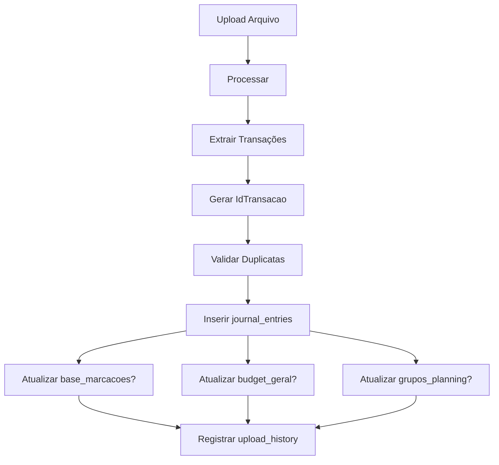

# 3️⃣ Revisão Completa - Upload

**Frente:** Revisão de Upload  
**Status:** 🔴 Não Iniciado  
**Prioridade:** 🔴 CRÍTICA  
**Responsável:** A definir  
**Data Início:** A definir  
**Deadline:** A definir

---

## 🎯 Objetivo

Revisar e aprimorar completamente o processo de upload de arquivos, garantindo conexão com base de bancos, mapeamento de atualizações e ajustes na tela de preview.

---

## 📋 Escopo Geral

### Incluído
- ✅ Conexão tela upload ↔ base de bancos
- ✅ Exibição de formatos (OK, WIP, TBD)
- ✅ Mapeamento de bases atualizadas
- ✅ Ajuste da tela de preview
- ✅ Botão + para adicionar grupo/subgrupo
- ✅ Correção de filtro classificados/não classificados

### Excluído
- ❌ Novos formatos de banco (fora do escopo)
- ❌ Processadores de novos tipos de arquivo

---

## 🏦 Sub-frente 3a: Conexão com Base de Bancos

### Objetivo
Conectar a tela de upload com a base de bancos para exibir quais formatos estão disponíveis e seus status.

### Status de Formato
- 🟢 **OK:** Formato totalmente suportado e testado
- 🟡 **WIP:** Work In Progress - parcialmente implementado
- 🔴 **TBD:** To Be Done - planejado mas não implementado

### Implementação

#### 3a.1 Backend - Base de Bancos
```python
# app/domains/upload/models.py
class BancoSuportado(Base):
    __tablename__ = "bancos_suportados"
    
    id = Column(Integer, primary_key=True)
    nome = Column(String, nullable=False)  # Ex: "Nubank"
    tipo = Column(String, nullable=False)  # "extrato" ou "fatura"
    formato = Column(String)  # "PDF", "Excel", etc
    status = Column(String, default="ok")  # "ok", "wip", "tbd"
    processador = Column(String)  # Nome do processador
    notas = Column(Text)  # Observações
```

#### 3a.2 Backend - API
```python
# app/domains/upload/router.py
@router.get("/bancos-suportados")
def list_bancos_suportados(db: Session = Depends(get_db)):
    """
    Lista todos os bancos suportados com seus status
    """
    bancos = db.query(BancoSuportado).order_by(
        BancoSuportado.status,  # ok primeiro
        BancoSuportado.nome
    ).all()
    
    return {
        "ok": [b for b in bancos if b.status == "ok"],
        "wip": [b for b in bancos if b.status == "wip"],
        "tbd": [b for b in bancos if b.status == "tbd"]
    }
```

#### 3a.3 Frontend - Tela de Upload
```typescript
// src/features/upload/components/upload-dialog.tsx
function BancosSuportados() {
  const { data: bancos } = useBancosSuportados()
  
  return (
    <div className="space-y-4">
      <h3>Bancos Suportados</h3>
      
      {/* OK */}
      <div>
        <Badge variant="success">✓ Funcionando</Badge>
        <ul>
          {bancos?.ok.map(b => (
            <li key={b.id}>
              {b.nome} - {b.tipo} ({b.formato})
            </li>
          ))}
        </ul>
      </div>
      
      {/* WIP */}
      <div>
        <Badge variant="warning">⚠ Em Desenvolvimento</Badge>
        <ul>
          {bancos?.wip.map(b => (
            <li key={b.id}>
              {b.nome} - {b.notas}
            </li>
          ))}
        </ul>
      </div>
      
      {/* TBD */}
      <div>
        <Badge variant="secondary">📋 Planejado</Badge>
        <ul>
          {bancos?.tbd.map(b => (
            <li key={b.id}>{b.nome}</li>
          ))}
        </ul>
      </div>
    </div>
  )
}
```

### Checklist 3a
- [ ] Criar tabela `bancos_suportados`
- [ ] Popular tabela com bancos atuais
- [ ] Criar API `/upload/bancos-suportados`
- [ ] Implementar componente no frontend
- [ ] Exibir na tela de upload
- [ ] Testar exibição de todos os status

---

## 🗄️ Sub-frente 3b: Mapeamento de Bases Atualizadas

### Objetivo
Mapear quais bases são atualizadas durante o processo de upload e validar que essas atualizações estão funcionando.

### Bases Envolvidas no Upload

#### Bases Principais
1. **journal_entries** - Transações importadas
2. **base_marcacoes** - Grupos/subgrupos
3. **base_grupos_config** - Configuração de tipos
4. **upload_history** - Histórico de uploads

#### Bases Auxiliares (podem ser atualizadas)
5. **budget_geral** - Orçamentos
6. **grupos_planning** - Planejamento mensal
7. **base_cartoes** - Cartões de crédito

### Fluxo de Atualização



### Mapeamento Detalhado

#### 3b.1 Momento de Atualização
```markdown
| Base                | Quando Atualizada | Condição | Validação |
|---------------------|-------------------|----------|-----------|
| journal_entries     | Sempre            | -        | ✅        |
| upload_history      | Sempre            | -        | ✅        |
| base_marcacoes      | Se novo grupo     | Manual   | ❓        |
| budget_geral        | Se transação nova | Auto     | ❓        |
| grupos_planning     | Se transação nova | Auto     | ❓        |
| base_cartoes        | Se cartão novo    | Manual   | ❓        |
```

#### 3b.2 Script de Validação
```python
# scripts/testing/validate_upload_flow.py
def validate_upload_updates(user_id: int, file_path: str):
    """
    Valida que todas as bases são atualizadas corretamente
    """
    # Estado antes
    before = {
        'journal_count': db.query(JournalEntry).filter_by(user_id=user_id).count(),
        'marcacoes_count': db.query(BaseMarcacao).count(),
        'budget_count': db.query(BudgetGeral).filter_by(user_id=user_id).count(),
    }
    
    # Fazer upload
    result = upload_processor.process(file_path, user_id)
    
    # Estado depois
    after = {
        'journal_count': db.query(JournalEntry).filter_by(user_id=user_id).count(),
        'marcacoes_count': db.query(BaseMarcacao).count(),
        'budget_count': db.query(BudgetGeral).filter_by(user_id=user_id).count(),
    }
    
    # Validar
    assert after['journal_count'] > before['journal_count'], "journal_entries não foi atualizado"
    # ... mais validações
```

### Checklist 3b
- [ ] Mapear todas as bases envolvidas no upload
- [ ] Documentar momento exato de cada atualização
- [ ] Implementar script de validação
- [ ] Testar fluxo completo de upload
- [ ] Validar que bases auxiliares atualizam corretamente
- [ ] Documentar comportamento esperado

---

## 🔍 Sub-frente 3c: Ajuste Tela Preview

### Objetivo
Ajustar a tela de preview para permitir adicionar grupos/subgrupos e corrigir filtro de classificados.

### 3c.1 Botão + para Adicionar Grupo/Subgrupo

#### Backend - API
```python
# app/domains/marcacoes/router.py
@router.post("/grupos")
def create_grupo(
    data: GrupoCreate,
    user_id: int = Depends(get_current_user_id),
    db: Session = Depends(get_db)
):
    """
    Cria novo grupo/subgrupo durante preview
    """
    grupo = BaseMarcacao(
        Marcacao=data.nome,
        UsuarioMarcacaoID=user_id,
        Tipo=data.tipo,  # "Grupo" ou "Subgrupo"
        GrupoPai=data.grupo_pai,  # Se subgrupo
        CategoriaGeral=data.categoria_geral
    )
    db.add(grupo)
    db.commit()
    return grupo
```

#### Frontend - Componente
```typescript
// src/features/upload/components/preview-add-group.tsx
function AddGroupButton({ onGroupAdded }: Props) {
  const [open, setOpen] = useState(false)
  const [tipo, setTipo] = useState<'Grupo' | 'Subgrupo'>('Grupo')
  
  const handleSubmit = async (data: FormData) => {
    const response = await fetch('/api/v1/marcacoes/grupos', {
      method: 'POST',
      body: JSON.stringify({
        nome: data.nome,
        tipo: tipo,
        grupo_pai: tipo === 'Subgrupo' ? data.grupo_pai : null,
        categoria_geral: data.categoria_geral
      })
    })
    
    if (response.ok) {
      onGroupAdded()
      setOpen(false)
    }
  }
  
  return (
    <>
      <Button onClick={() => setOpen(true)}>
        <Plus className="h-4 w-4" />
        Adicionar Grupo
      </Button>
      
      <Dialog open={open} onOpenChange={setOpen}>
        {/* Form para criar grupo/subgrupo */}
      </Dialog>
    </>
  )
}
```

#### Integração na Preview
```typescript
// src/features/upload/components/upload-preview.tsx
function UploadPreview({ transactions }: Props) {
  return (
    <div>
      <div className="flex justify-between items-center">
        <h2>Preview de Transações</h2>
        <AddGroupButton onGroupAdded={refreshGroups} />
      </div>
      
      {/* Tabela de transações */}
      <TransactionsTable data={transactions} />
    </div>
  )
}
```

### 3c.2 Correção de Filtro Classificados/Não Classificados

#### Problema Identificado
- Filtro não preenche corretamente a origem da base
- Transações aparecem incorretamente como classificadas/não classificadas

#### Correção Backend
```python
# app/domains/upload/service.py
def get_preview_transactions(file_id: str):
    """
    Retorna transações com classificação correta
    """
    transactions = db.query(JournalEntry).filter_by(
        upload_id=file_id
    ).all()
    
    for t in transactions:
        # Verificar se está classificado corretamente
        t.is_classified = (
            t.Grupo is not None and 
            t.Grupo != '' and
            t.Grupo in valid_groups  # Validar contra base_marcacoes
        )
        
        # Preencher origem da base
        t.source_base = 'base_marcacoes' if t.is_classified else None
    
    return transactions
```

#### Correção Frontend
```typescript
// src/features/upload/components/preview-filters.tsx
function PreviewFilters({ onFilterChange }: Props) {
  const [filter, setFilter] = useState<'all' | 'classified' | 'unclassified'>('all')
  
  const handleFilterChange = (newFilter) => {
    setFilter(newFilter)
    
    // Aplicar filtro correto
    onFilterChange(transactions => {
      if (newFilter === 'all') return transactions
      if (newFilter === 'classified') {
        return transactions.filter(t => t.is_classified)
      }
      return transactions.filter(t => !t.is_classified)
    })
  }
  
  return (
    <ToggleGroup type="single" value={filter} onValueChange={handleFilterChange}>
      <ToggleGroupItem value="all">Todos</ToggleGroupItem>
      <ToggleGroupItem value="classified">Classificados</ToggleGroupItem>
      <ToggleGroupItem value="unclassified">Não Classificados</ToggleGroupItem>
    </ToggleGroup>
  )
}
```

### Checklist 3c
- [ ] Criar API para adicionar grupo/subgrupo
- [ ] Implementar botão + na preview
- [ ] Testar criação de grupo durante preview
- [ ] Corrigir lógica de classificação no backend
- [ ] Corrigir filtro no frontend
- [ ] Validar que filtro mostra transações corretas
- [ ] Testar fluxo completo de preview

---

## 🧪 Validação Geral

### Fluxo Completo
```markdown
1. [ ] Acessar tela de upload
2. [ ] Visualizar bancos suportados (OK, WIP, TBD)
3. [ ] Fazer upload de arquivo
4. [ ] Visualizar preview com transações
5. [ ] Clicar em + para adicionar novo grupo
6. [ ] Criar grupo/subgrupo
7. [ ] Filtrar por classificados/não classificados
8. [ ] Confirmar upload
9. [ ] Validar que bases foram atualizadas:
   - [ ] journal_entries
   - [ ] base_marcacoes (se novo grupo)
   - [ ] budget_geral (se aplicável)
   - [ ] grupos_planning (se aplicável)
10. [ ] Verificar histórico de upload
```

---

## 📊 Métricas

### Progresso
```
3a - Base Bancos:     ░░░░░░░░░░ 0%
3b - Mapeamento:      ░░░░░░░░░░ 0%
3c - Ajuste Preview:  ░░░░░░░░░░ 0%
TOTAL:                ░░░░░░░░░░ 0%
```

---

## 🚧 Riscos

1. **Alto:** Mudanças no upload podem quebrar processadores existentes
2. **Médio:** Adicionar grupo durante preview pode causar inconsistências
3. **Médio:** Filtro pode não funcionar para todos os tipos de arquivo

### Mitigações
1. Testar cada processador após mudanças
2. Validar integridade de grupos criados
3. Testar filtro com múltiplos tipos de arquivo

---

## 📝 Próximos Passos

1. [ ] Iniciar por 3a (base de bancos - mais simples)
2. [ ] Seguir para 3b (mapeamento - investigação)
3. [ ] Finalizar com 3c (ajustes preview - mais complexo)

---

## 🔗 Referências

- [PLANO_FINALIZACAO.md](./PLANO_FINALIZACAO.md)
- Processadores: `app_dev/backend/app/domains/upload/processors/`

---

**Última Atualização:** 10/02/2026
