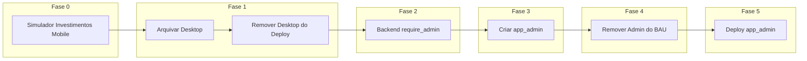

# Plano de Execução: Migração BAU (Visão Mobile + Admin Separado)

Arquivo central com o passo a passo para:
1. **Simulador de Investimentos Mobile** (antes da migração)
2. **Remoção das telas desktop** do deploy
3. **Criação do app_admin** e separação do admin
4. **Gestão de usuários** – tela de contas, adicionar usuário, dados iniciais (grupos/marcações)

---

## Visão Geral da Sequência



---

## Fase 0: Simulador de Investimentos Mobile

**Objetivo:** Construir a tela de simulação de investimentos em versão mobile antes de remover o desktop, garantindo paridade de funcionalidade.

### 0.1 Referência: Simulador Desktop

- **Rota atual:** `/investimentos/simulador`
- **Componente:** `features/investimentos/components/simulador-cenarios.tsx`
- **APIs usadas:**
  - `GET /api/v1/investimentos/historico/ultimo` – patrimônio atual
  - `POST /api/v1/investimentos/cenarios` – criar cenário salvo
  - `GET /api/v1/investimentos/cenarios/{id}/simular` – simular cenário salvo
  - Simulação personalizada: cálculo local no frontend (sem backend)

### 0.2 Funcionalidades a implementar (mobile)

| Funcionalidade | Desktop | Mobile |
|----------------|---------|--------|
| Patrimônio inicial (da API) | Sim | Sim |
| Taxa de rendimento anual (%) | Sim | Sim |
| Aporte mensal (R$) | Sim | Sim |
| Período (meses) | Sim | Sim |
| Aportes extraordinários | Sim (completo) | Simplificado (opcional) |
| Gráfico de projeção | Recharts LineChart | Recharts responsivo |
| Salvar cenário no banco | Sim | Sim |
| Listar cenários salvos | Sim | Sim |

### 0.3 Passos de implementação

1. **Criar página:** `app/mobile/investimentos/simulador/page.tsx`
   - Layout mobile (MobileHeader, sem sidebar)
   - Usar `useRequireAuth`

2. **Criar componente:** `features/investimentos/components/mobile/simulador-mobile.tsx`
   - Reutilizar lógica de `simulador-cenarios.tsx` (hooks, cálculos)
   - UI adaptada: inputs touch-friendly, cards em coluna, gráfico responsivo
   - Opcional: aportes extraordinários em Sheet/accordion (simplificado)

3. **Integrar APIs existentes:**
   - `getHistoricoUltimo` ou equivalente (investimentos/historico/ultimo)
   - `criarCenario`, `listarCenarios`, `simularCenarioSalvo` de `investimentos-api.ts`

4. **Ponto de entrada:**
   - Botão "Simulador" na tela `/mobile/investimentos` (header ou card)
   - Ou link no PatrimonioTab do dashboard

5. **Testar:** Simulação rápida, salvar cenário, gráfico em tela pequena

### 0.4 Arquivos a criar/alterar

- `app_dev/frontend/src/app/mobile/investimentos/simulador/page.tsx` (novo)
- `app_dev/frontend/src/features/investimentos/components/mobile/simulador-mobile.tsx` (novo)
- `app_dev/frontend/src/app/mobile/investimentos/page.tsx` (adicionar botão Simulador)
- `app_dev/frontend/src/features/investimentos/services/investimentos-api.ts` (verificar se `historico/ultimo` está mapeado)

---

## Fase 1: Remoção das Telas Desktop

**Objetivo:** Arquivar telas desktop em `_arquivo_desktop/` e remover do deploy.

### 1.1 Criar pasta de arquivo

```
ProjetoFinancasV5/_arquivo_desktop/
├── app/
│   ├── dashboard/
│   ├── transactions/
│   ├── budget/
│   ├── investimentos/
│   ├── upload/
│   ├── settings/
│   └── history/
├── components/
│   ├── dashboard-layout.tsx
│   ├── app-sidebar.tsx
│   ├── nav-main.tsx
│   ├── nav-projects.tsx
│   └── nav-user.tsx
└── features/
    ├── dashboard/credit-card-expenses.tsx
    ├── budget/budget-media-drilldown-modal*.tsx
    └── investimentos/simulador-cenarios.tsx
```

### 1.2 Copiar (backup) e remover

1. Copiar pastas e arquivos listados para `_arquivo_desktop/`
2. Remover do `app_dev/frontend/src/`:
   - `app/dashboard/`
   - `app/transactions/`
   - `app/budget/`
   - `app/investimentos/`
   - `app/upload/`
   - `app/settings/`
   - `app/history/`
3. Remover componentes desktop-only (verificar imports antes)

### 1.3 Ajustes no app

1. **app/page.tsx:** `redirect('/dashboard')` → `redirect('/mobile/dashboard')`
2. **middleware.ts:** Remover lógica `prefersDesktop`; sempre redirecionar para mobile
3. **Rotas a manter:** `/login`, `/mobile/*`, `/api/*`

### 1.4 Verificação

- Build sem erros
- Fluxos mobile funcionando (dashboard, transactions, budget, upload, investimentos, simulador, profile)

---

## Fase 2: Backend – require_admin

**Objetivo:** Garantir que todos os endpoints admin exijam `require_admin`.

### 2.1 Arquivos a alterar

- `app_dev/backend/app/domains/screen_visibility/router.py`
  - `list_all_screens_admin`, `create_screen`, `update_screen`, `delete_screen`, `reorder_screens`
- `app_dev/backend/app/domains/compatibility/router.py` (bancos)
- Routers de backup e categorias genéricas (se existirem)

### 2.2 Verificação

- Endpoints admin retornam 403 para usuário não-admin

---

## Fase 3: Criar app_admin

**Objetivo:** Projeto separado em `admin.meufinup.com.br`.

### 3.1 Estrutura

```
ProjetoFinancasV5/app_admin/
├── frontend/
│   ├── src/
│   │   ├── app/
│   │   │   ├── layout.tsx
│   │   │   ├── page.tsx          # Login
│   │   │   └── (admin)/
│   │   │       ├── page.tsx      # Dashboard (lista de seções)
│   │   │       ├── contas/page.tsx
│   │   │       ├── screens/page.tsx
│   │   │       ├── bancos/page.tsx
│   │   │       ├── backup/page.tsx
│   │   │       └── categorias-genericas/page.tsx
│   │   ├── components/
│   │   └── core/                 # Auth, API client (copiar do BAU)
│   └── package.json
└── README.md
```

### 3.2 Passos

1. Criar `app_admin/frontend/` com Next.js
2. Copiar `core/` (auth, api-client, hooks) do BAU
3. Implementar login (reutilizar `/api/v1/auth/login`)
4. Layout tipo perfil mobile: lista de seções (Contas, Telas, Bancos, Backup, Categorias Genéricas)
5. Uma página por funcionalidade, refatorada para mobile
6. `RequireAdmin` em todas as rotas admin

### 3.3 Telas a migrar

| De (BAU) | Para (app_admin) |
|----------|------------------|
| `/settings/admin` | `/contas` |
| `/settings/screens` | `/screens` |
| `/settings/bancos` | `/bancos` |
| `/settings/backup` | `/backup` |
| `/settings/categorias-genericas` | `/categorias-genericas` |

### 3.4 Tela de Gestão de Usuários (Contas) – Detalhamento

A tela `/contas` no app_admin deve incluir:

**Lista de usuários:**
- Nome, email, status (ativo/inativo), role
- **Observações (quantidade de dados):** transações, uploads, investimentos, etc. (ver seção 3.5)

**Adicionar usuário:**
- Campos: email, nome, celular (novo campo no backend)
- Gerador de senha aleatória (botão que gera e exibe senha temporária)
- Ao criar: executar seed de dados iniciais (ver seção 3.6)

**Quando for criado:** (completar conforme necessidade – ex.: enviar email com credenciais, forçar troca de senha no primeiro login, etc.)

---

### 3.5 Mapeamento: Observações (quantidade de dados por usuário)

| Métrica | Tabela | Query |
|---------|--------|-------|
| Transações | `journal_entries` | `COUNT(*) WHERE user_id = ?` |
| Uploads | `upload_history` | `COUNT(*) WHERE user_id = ?` |
| Investimentos | `investimentos_portfolio` | `COUNT(*) WHERE user_id = ?` |
| Metas (budget) | `budget_planning` | `COUNT(*) WHERE user_id = ?` |
| Exclusões | `transacoes_exclusao` | `COUNT(*) WHERE user_id = ?` |
| Cartões | `cards` | `COUNT(*) WHERE user_id = ?` |

**Backend:** Criar endpoint `GET /api/v1/users/{id}/stats` (admin) retornando contagens.

---

### 3.6 Mapeamento: Dados iniciais ao criar novo usuário

**Contexto:** `base_grupos_config` e `base_marcacoes` são tabelas **globais** (sem `user_id`). Todas as combinações grupo+subgrupo usadas na classificação vêm de `generic_classification_rules` (marcação genérica no upload).

**Ao criar usuário, garantir que as bases globais tenham os dados necessários:**

| Fonte | Destino | Ação |
|-------|---------|------|
| `generic_classification_rules` | `base_grupos_config` | Inserir grupos que não existem (nome_grupo, tipo_gasto, categoria_geral) |
| `generic_classification_rules` | `base_marcacoes` | Inserir combinações GRUPO+SUBGRUPO que não existem |

**Algoritmo de seed (executar no create_user ou em job separado):**
1. Buscar todas as regras ativas de `generic_classification_rules` (grupo, subgrupo, tipo_gasto)
2. Para cada grupo único: se não existe em `base_grupos_config`, inserir com tipo_gasto e categoria_geral (mapear: Fixo/Ajustável/Investimentos/Transferência/Receita)
3. Para cada (grupo, subgrupo) único: se não existe em `base_marcacoes`, inserir

**Outras tabelas user-specific:** Não precisam de seed. O usuário começa vazio:
- `journal_entries`, `upload_history`, `budget_planning`, `investimentos_*`, `exclusoes`, `cards`, `base_parcelas`, `base_padroes` – criadas/ populadas conforme o usuário usa o app

**Avaliação – mais algum dado inicial?**
- **Compatibilidade (bancos):** Global – não precisa seed por usuário
- **Regras genéricas:** Global – não precisa seed por usuário
- **Telas (screen_visibility):** Se houver telas por usuário, avaliar insert para novo user; atualmente parece global
- **Conclusão:** Apenas garantir que `base_grupos_config` e `base_marcacoes` estejam sincronizadas com `generic_classification_rules`. Nenhum outro dado inicial necessário.

---

### 3.7 Backend: Alterações para criação de usuário

| Arquivo | Alteração |
|---------|-----------|
| `users/models.py` | Adicionar coluna `celular` (String, nullable) |
| `users/schemas.py` | `UserCreate`: adicionar `celular: Optional[str] = None`; `UserResponse`: incluir `celular` |
| `users/service.py` | No `create_user`: (1) incluir celular no User; (2) chamar `seed_grupos_marcacoes_from_generic_rules()` após criar usuário |
| Novo: `users/seed_new_user.py` ou em `classification/service.py` | Função `sync_base_from_generic_rules()` – extrair de `generic_classification_rules` e popular `base_grupos_config` + `base_marcacoes` |

**Migration:** Criar migration para adicionar `celular` em `users`.

---

## Fase 4: Remover Admin do BAU

**Objetivo:** BAU sem código admin.

### 4.1 Remover do BAU

- Seção Administração do sidebar (já removida com desktop)
- `RequireAdmin`, badge admin no perfil mobile
- Atualizar `insert_screens.py` – não incluir telas admin no BAU

### 4.2 Verificação

- BAU não expõe rotas admin
- app_admin funciona com login admin

---

## Fase 5: Deploy app_admin

**Objetivo:** admin.meufinup.com.br em produção.

### 5.1 Passos

1. DNS: `admin.meufinup.com.br` → VM
2. Nginx: `admin.meufinup.com.br` → app_admin (porta 3001)
3. CORS no backend: incluir `https://admin.meufinup.com.br`
4. SSL: Certbot para admin.meufinup.com.br
5. systemd: serviço `finup-admin`

---

## Resumo da Ordem de Execução

| # | Fase | Descrição | Status |
|---|------|-----------|--------|
| 0 | Simulador Mobile | Criar `/mobile/investimentos/simulador` | Concluído |
| 1 | Remoção Desktop | Arquivar em `_arquivo_desktop/`, remover do deploy | Concluído |
| 2 | Backend | `require_admin` em endpoints admin | Concluído |
| 3 | app_admin | Criar projeto, login, telas mobile | Concluído |
| 4 | BAU | Remover admin do BAU | Concluído |
| 5 | Deploy | DNS, Nginx, SSL, CORS, systemd | Pendente |

---

## Referências

- Plano detalhado desktop: `~/.cursor/plans/remoção_telas_desktop_a9a6cb75.plan.md`
- Plano detalhado admin: `~/.cursor/plans/separação_admin_app_admin_9daf8a50.plan.md`
- Simulador desktop: `app_dev/frontend/src/features/investimentos/components/simulador-cenarios.tsx`
- API investimentos: `app_dev/frontend/src/features/investimentos/services/investimentos-api.ts`
